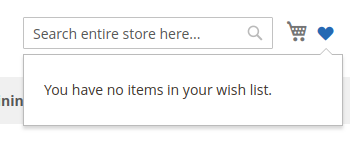
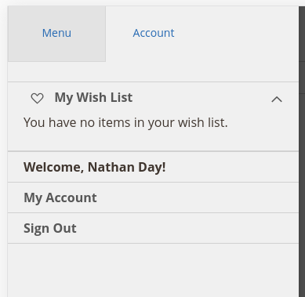
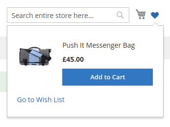
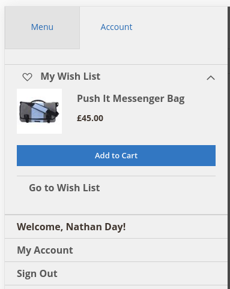

# Wishlist Dropdown

## Description

Magento 2 Module to add Customer Wishlist as a Dropdown to the Site Header

State | Desktop | Mobile
-- | --- | ---
Empty |  | 
Filled |  | 

## Install Instructions

### Install Via Composer (Recommended)
```BAASH
composer config repositories.nathanday/module-core git git@github.com:natedawg92/module-core.git
composer config repositories.nathanday/module-wishlist-dropdown git git@github.com:natedawg92/module-wishlist-dropdown.git
composer require nathanday/module-wishlist-dropdown

php bin/magento module:enable NathanDay_WishlistDropdown NathanDay_Core
```

### Install via Code Copy

1. Download the latest releases from:
    - [natedawg92/module-core](https://github.com/natedawg92/module-core/releases) **AND**
    - [natedawg9/module-wishlist-dropdown](https://github.com/natedawg92/module-wishlist-dropdown/releases)
2. Create the following Directories
    - `app/code/NathanDay/Core`
    - `app/code/NathanDay/WishlistDropdown`
3. Extract the downloaded files into the appropriate directory
4. run `php bin/magento module:enable NathanDay_Core NathanDay_WishlistDropdown`

## Credits

[Email](mailto:nathanday92@gmail.com)
[GitHub](https://github.com/natedawg92)
[LinkedIn](https://www.linkedin.com/in/nathanday92/)

## License